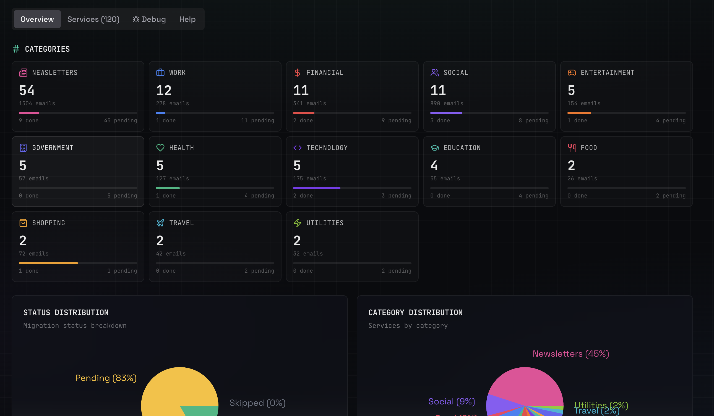
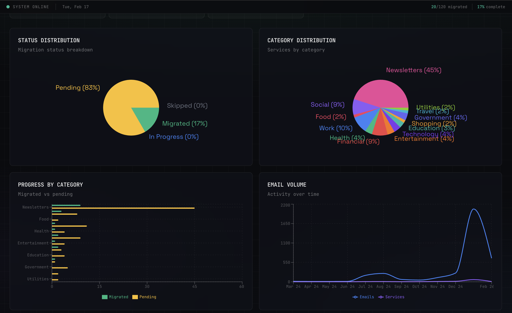
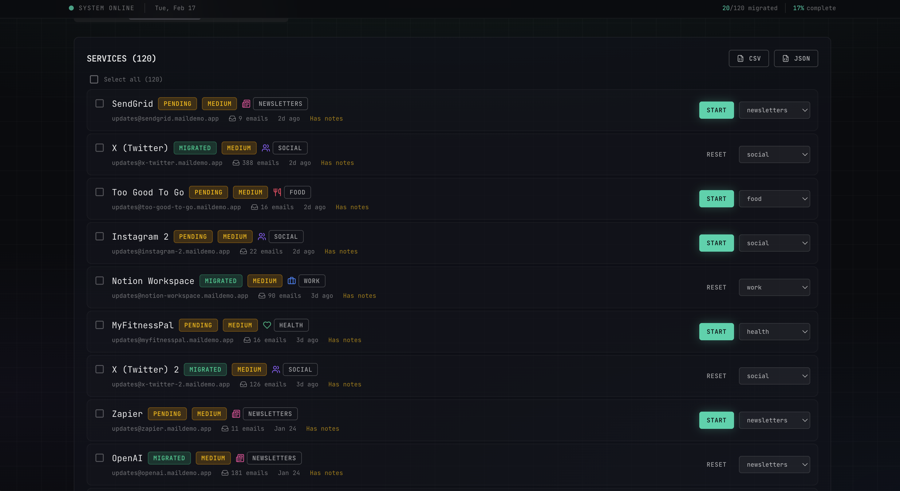
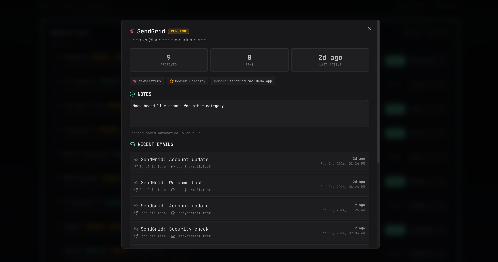
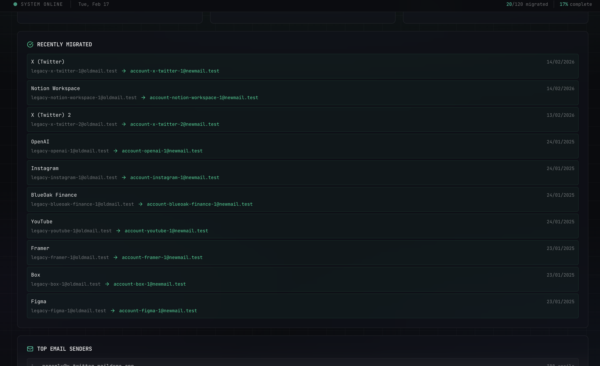

# Email Migration Tracker

A beautiful dashboard to track your email migration progress from Gmail to ProtonMail (or any IMAP-accessible email service). Automatically discovers services using your old email address and helps you manage the migration to your new email.


> Mockup dataset shown in screenshots: **120 services**, **20 migrated**.

## Features

- **🔍 Automatic Service Discovery** - Scans your ProtonMail inbox to find all services using your old email
- **✨ Smart Migration Detection** - Auto-detects services you've already migrated based on recipient email patterns
- **📂 Category Management** - Auto-categorizes services (financial, social, work, shopping, etc.) with smart keyword matching
- **⚡ Priority Tracking** - Focus on high-priority services like banks and government agencies
- **📧 Email Metadata** - View recent emails from each service with subjects and timestamps
- **📊 Progress Visualization** - Charts and stats to track your migration progress
- **🤖 Built-in Scheduler** - Automatic background scans with configurable cron schedule (no external cron setup needed!)
- **⚙️ Fully Configurable** - Customize categories, priorities, and behavior via YAML config
- **🐳 Docker Ready** - Includes Docker Compose setup for easy deployment

## Screenshots

### Overview


### Gallery
- 
- 
- 
- 
- 

## How It Works

1. **Connects to ProtonMail** via IMAP (using Proton Bridge running locally)
2. **Scans recent emails** in your inbox (configurable limit, e.g., last 5,000 emails)
3. **Groups by sender** to identify unique services/companies
4. **Auto-categorizes** based on domain keywords (financial, social, shopping, etc.)
5. **Detects migrations** by tracking when services start sending to your new email domains
6. **Stores everything** in a local SQLite database
7. **Displays in dashboard** with search, filters, and progress tracking

## Quick Start

### Prerequisites

- **Node.js 18+** (or use Docker)
- **Proton Bridge** installed and running locally ([Download](https://proton.me/mail/bridge))
- **ProtonMail account** with IMAP access enabled

### 1. Clone & Install

```bash
git clone https://github.com/Sabrimjd/email-migration-tracker.git
cd email-migration-tracker
npm install
```

### 2. Configure

Copy the example config and customize it:

```bash
cp config.yml.example config.yml
```

Edit `config.yml` with your details:

```yaml
emails:
  old_address: "yourname@gmail.com"           # Your old email
  new_domains:                                # Your new email domains
    - "yourdomain.com"
  personal_domains:                           # Your own domains (excluded from tracking)
    - "gmail.com"
    - "protonmail.com"
    - "yourdomain.com"

protonmail:
  imap_host: "127.0.0.1"                     # Proton Bridge IMAP host
  imap_port: 1143                             # Proton Bridge IMAP port (default: 1143)
  imap_user: "your-email@yourdomain.com"      # Your ProtonMail address
  imap_password: "YOUR_BRIDGE_PASSWORD"       # Get this from Proton Bridge settings
  email_scan_limit: 5000                      # How many recent emails to scan

database:
  path: "data/migration.db"                   # SQLite database location

server:
  port: 3000                                  # Dashboard port

dashboard:
  title: "Email Migration Tracker"
  subtitle: "Track your email migration progress"
  theme: "dark"                               # "dark" or "light"
  accent_color: "#00d4aa"
```

**Important:** Get your Proton Bridge password from the Bridge app (not your ProtonMail password):
1. Open Proton Bridge
2. Go to Settings → Account → Your Email
3. Copy the IMAP password (or generate a new one)

### 3. Run Email Analysis

```bash
npm run analyze-emails
```

This will:
- Connect to ProtonMail via IMAP (through Proton Bridge)
- Scan your recent emails (up to the configured limit)
- Detect services using your old email
- Auto-detect already-migrated services (those sending to your new domains)
- Populate the SQLite database with services and email metadata

Expected output:
```
Starting email analysis...

Fetching recent emails via IMAP...
   Connected to IMAP server
   Total emails in inbox: 12543
   Fetching emails 7544 to 12543 (5000 emails)...
   Fetched 5000 emails

Detected 42 services already migrated

Found 788 services to track

Processing email metadata...
   Stored 5153 email records

Analysis complete!

Top 10 services by email volume:
================================================================================
1. Amazon                                     (234 emails) [shopping]
2. GitHub                                     (189 emails) [technology]
3. PayPal                                     (156 emails) [financial] [MIGRATED]
...
================================================================================

Total services: 788
Migrated: 42
Database saved to: data/migration.db
```

### 4. Start the Dashboard

**Development mode:**
```bash
npm run dev
```

**Production mode:**
```bash
npm run build
npm start
```

Visit **http://localhost:3000**

### 5. Docker Deployment (Optional)

For production deployment:

```bash
# Build and start
docker-compose up -d

# View logs
docker-compose logs -f

# Stop
docker-compose down
```

The dashboard will be available at **http://localhost:3200** (mapped from container port 3000).

## Configuration Reference

### Email Settings

| Setting | Description |
|---------|-------------|
| `emails.old_address` | The email address you're migrating FROM (e.g., old Gmail) |
| `emails.new_domains` | Domains you've migrated TO (used for auto-migration detection) |
| `emails.personal_domains` | Your own domains to exclude from service tracking |

### ProtonMail IMAP Settings

| Setting | Description |
|---------|-------------|
| `protonmail.imap_host` | IMAP server host (default: `127.0.0.1` for Proton Bridge) |
| `protonmail.imap_port` | IMAP port (default: `1143` for Proton Bridge) |
| `protonmail.imap_user` | Your ProtonMail email address |
| `protonmail.imap_password` | IMAP password from Proton Bridge (NOT your ProtonMail password) |
| `protonmail.email_scan_limit` | Number of recent emails to analyze (e.g., 5000) |

### Categories

Customize service categories with keywords for auto-categorization:

```yaml
categories:
  financial:
    keywords:
      - paypal
      - bank
      - stripe
      - visa
    color: "#ef4444"      # Red
    icon: "DollarSign"
    priority: high        # Always mark as high priority
```

**Available icons:** `DollarSign`, `Users`, `ShoppingBag`, `Briefcase`, `Building`, `Heart`, `Plane`, `Gamepad2`, `GraduationCap`, `Utensils`, `Code`, `Zap`, `Newspaper`

**Category priorities:**
- `high` - Always marked as high priority (e.g., financial, government)
- `low` - Always marked as low priority (e.g., newsletters)
- Omit field for default medium priority

### Priority Domains

Services from these domains will always be marked as high priority:

```yaml
priority:
  high_domains:
    - paypal
    - bank
    - gov
    - tax
```

## Usage

### Migration Workflow

1. **📋 Review Services** - Browse all discovered services in the dashboard
2. **🏷️ Check Categories** - Services are auto-categorized; adjust manually if needed
3. **⚠️ Set Priorities** - High-priority items (financial, government) are flagged
4. **✉️ Migrate** - Visit each service's website and update your email address
5. **✅ Mark Complete** - Update status to "Migrated" or "In Progress"
6. **📈 Track Progress** - Watch your migration percentage grow!

### Smart Migration Detection

The tracker automatically detects services you've already migrated:

- If a service starts sending emails **to your new domains**, it's auto-marked as **"Migrated"**
- The migration date is recorded automatically (date of first email to new domain)
- No manual updates needed for already-migrated services
- Re-run `npm run analyze-emails` periodically to detect new migrations

### Viewing Email Details

Click on any service to see:
- Last 10 emails received
- Email subjects and senders
- Timestamps with relative time (e.g., "2 hours ago")
- Read/unread status

### Automatic Scheduled Scans (Built-in Daemon)

The app includes a **built-in scheduler** that runs automatic email scans in the background — no external cron setup needed!

**Configuration** (`config.yml`):
```yaml
scheduler:
  enabled: true           # Enable/disable automatic scans
  cron: "0 6 * * *"       # Schedule (default: 6 AM daily)
```

**Cron schedule examples:**
- `"0 6 * * *"` - Every day at 6:00 AM
- `"0 */6 * * *"` - Every 6 hours
- `"*/30 * * * *"` - Every 30 minutes
- `"0 0 * * 0"` - Every Sunday at midnight

**Dashboard controls:**
- View last scan time and next scheduled scan
- See results from the last run (emails scanned, services found, errors)
- Manually trigger a scan with the "Run Scan Now" button
- Monitor scheduler status in real-time

**How it works:**
1. The scheduler starts automatically when the dashboard runs (`npm run dev` or `npm start`)
2. It runs email analysis in the background according to your cron schedule
3. Results are stored in the database and visible in the dashboard
4. Logs are written to the console (capture with Docker logs or systemd)

**Manual runs (CLI):**
You can still run analysis manually:
```bash
npm run analyze-emails
```

**Legacy cron (optional):**
If you prefer external cron instead of the built-in scheduler, disable it in config:
```yaml
scheduler:
  enabled: false
```

Then use the provided script (`scripts/daily-analyze.sh`) with crontab.

## API Endpoints

| Endpoint | Method | Description |
|----------|--------|-------------|
| `/api/services` | GET | List all services with stats |
| `/api/services/[id]` | PATCH | Update service status/category/priority |
| `/api/services/[id]/emails` | GET | Get recent emails for a service |
| `/api/stats` | GET | Get migration statistics |
| `/api/history` | GET | View scan history |
| `/api/categories` | GET | Get all categories |
| `/api/recategorize` | POST | Recategorize all services based on current config |
| `/api/scheduler/status` | GET | Get scheduler status (enabled, schedule, last/next run) |
| `/api/scheduler/trigger` | POST | Manually trigger an email analysis scan |

## Tech Stack

- **Frontend:** Next.js 16 + React 19 + TypeScript
- **Styling:** Tailwind CSS 4
- **Charts:** Recharts
- **Database:** SQLite (better-sqlite3)
- **Email:** Native IMAP (via npm `imap` package + Proton Bridge)
- **UI Components:** shadcn/ui-inspired design
- **Configuration:** YAML

## Project Structure

```
email-migration-tracker/
├── config.yml              # Your local config (gitignored)
├── config.yml.example      # Example config (committed)
├── docker-compose.yml      # Docker deployment config
├── Dockerfile              # Docker image definition
├── scripts/
│   ├── analyze-emails.ts   # Email scanning script (TypeScript)
│   └── daily-analyze.sh    # Cron script for daily runs
├── src/
│   ├── app/                # Next.js app routes
│   │   ├── api/            # API endpoints
│   │   ├── page.tsx        # Dashboard page
│   │   └── globals.css     # Global styles
│   ├── components/         # React components
│   │   └── ui/             # UI primitives (button, card, etc.)
│   └── lib/                # Utilities
│       ├── config.ts       # Config loader
│       ├── db.ts           # Database utilities
│       └── utils.ts        # Helpers
├── data/                   # SQLite database (gitignored)
├── logs/                   # Scan logs (gitignored)
└── schema.sql              # Database schema reference
```

## Customization

### Adding New Categories

Edit `config.yml`:

```yaml
categories:
  gaming:
    keywords:
      - steam
      - epic
      - playstation
      - xbox
    color: "#9333ea"
    icon: "Gamepad2"
    priority: medium  # or: high, low
```

Then recategorize existing services:

```bash
curl -X POST http://localhost:3000/api/recategorize
```

### Changing Theme Colors

Update `config.yml`:

```yaml
dashboard:
  theme: "light"              # Switch to light theme
  accent_color: "#ff6b6b"     # Change accent color
```

Or edit `src/app/globals.css` for deeper customization.

## Troubleshooting

### "No config file found"

Make sure you've copied and edited the config:
```bash
cp config.yml.example config.yml
nano config.yml  # Edit with your details
```

### "IMAP connection error" or "Stored 0 email records"

**Check that Proton Bridge is running:**
```bash
# Linux
systemctl --user status protonmail-bridge

# macOS/Windows: Check the app is running
```

**Test IMAP connection manually:**
```bash
# Install telnet or netcat
telnet 127.0.0.1 1143

# You should see:
# * OK [CAPABILITY ...] Proton Mail Bridge ready
```

**Verify credentials:**
1. Open Proton Bridge app
2. Go to your account settings
3. Copy the IMAP password (not your ProtonMail login password)
4. Paste into `config.yml` under `protonmail.imap_password`

### "Database locked" errors

Only one process can write to SQLite at a time:
- Stop the dashboard (`Ctrl+C`) before running `analyze-emails`
- Or wait a few seconds between operations
- In production, run analysis during low-traffic periods

### UTF-8 encoding issues in email subjects

The script includes automatic UTF-8 decoding for:
- MIME-encoded words (`=?UTF-8?B?...?=` and `=?UTF-8?Q?...?=`)
- Double-encoded UTF-8 (common with international characters)

If you still see garbled text, it's likely an edge case. Please open an issue with an example.

### Docker port conflicts

If port 3200 is already in use:

```yaml
# Edit docker-compose.yml
ports:
  - "3201:3000"  # Use 3201 instead
```

## Performance Notes

- **Initial scan** of 5,000 emails takes ~30-60 seconds
- **Database size:** ~1-2 MB per 1,000 emails
- **Dashboard load time:** <500ms for 1,000 services
- **Memory usage:** ~50 MB for analysis, ~100 MB for dashboard

## Security & Privacy

- ✅ All data stays **local** (SQLite database in `data/`)
- ✅ No external API calls (except to your own ProtonMail via IMAP)
- ✅ `.gitignore` excludes `config.yml`, `data/`, and logs
- ⚠️ Make sure `config.yml` is never committed (it contains your IMAP password)
- ⚠️ Proton Bridge password is stored in plaintext in config — protect this file
- 🔒 Recommended: Use file permissions to restrict config access
  ```bash
  chmod 600 config.yml  # Read/write for owner only
  ```

## Contributing

Contributions are welcome! Here's how:

1. Fork the repository
2. Create a feature branch (`git checkout -b feature/amazing-feature`)
3. Make your changes
4. Test thoroughly (especially the email analysis script)
5. Commit with clear messages (`git commit -m 'Add amazing feature'`)
6. Push to your fork (`git push origin feature/amazing-feature`)
7. Open a Pull Request

### Development Tips

- Use `npm run dev` for hot-reload during UI development
- Test email analysis on a small limit first (`email_scan_limit: 100`)
- Check `logs/` for detailed analysis output
- Use `sqlite3 data/migration.db` to inspect the database directly

## Roadmap

- [ ] Export to CSV/JSON
- [ ] Bulk status updates
- [ ] Email templates for migration requests
- [ ] Gmail IMAP support (not just ProtonMail)
- [ ] Multi-account support
- [ ] Browser extension for one-click status updates
- [ ] Mobile app (React Native)

## License

MIT License - feel free to use and modify for your own migration tracking needs.

## Acknowledgments

- Built with [Next.js](https://nextjs.org/) and [Tailwind CSS](https://tailwindcss.com/)
- Inspired by the pain of manually tracking hundreds of email migrations
- Icons from [Lucide](https://lucide.dev/)
- Charts from [Recharts](https://recharts.org/)

---

**Questions or issues?** Open an issue on [GitHub](https://github.com/Sabrimjd/email-migration-tracker/issues).

**Found this helpful?** Give it a ⭐ on GitHub!
