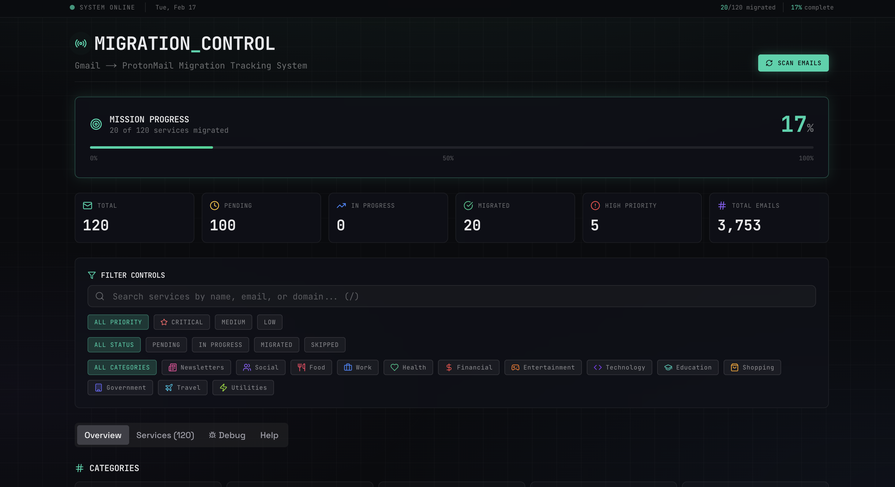

# Email Migration Tracker

Track your **Gmail → ProtonMail** migration progress with a clean dashboard and automatic service detection.



> Mock dataset shown in screenshots: **120 services**, **20 migrated**.

## Screenshots

More screenshots and full gallery: [`screenshots/README.md`](screenshots/README.md)

## What this app does

- Scans your Proton inbox via IMAP (Proton Bridge)
- Detects services that still use your old Gmail address
- Auto-marks services as migrated when emails start arriving on your new domains
- Shows progress, categories, priority, and recent activity in a dashboard
- Runs automatic scans with the built-in scheduler

## Features

### Dashboard Tabs

- **Overview**: Migration progress, stats, and category distribution charts
- **Services**: Searchable list with bulk actions, filtering, and service details
- **Config**: Visual configuration manager for all app settings
- **Database**: Database health monitoring, backups, and management
- **Debug**: System status and scheduler monitoring

### First-Time Setup Wizard

The app guides you through a **two-step onboarding flow** on first launch:

**Step 1: Identity**
- Enter your old email address (the one you're migrating from)
- Add your new domains (where migrated services should send emails)
- Optionally configure personal domains to exclude from tracking

**Step 2: Connectivity**
- Configure IMAP connection settings
- Test your IMAP connection with one click
- Set up automatic scanning schedule

The wizard saves everything to `config.local.yml`, preserving your original `config.yml`.

**Re-run Setup**: Click "Setup Wizard" in the Config tab anytime to update your configuration through the guided flow.

### Configuration Manager

The Config tab provides a comprehensive UI for managing settings without editing YAML files:

- Email addresses (old Gmail, new domains, personal domains)
- IMAP connection settings with **real connection test**
- Scheduler configuration (enable/disable, cron schedule)
- Category customization
- Priority domains
- Dashboard appearance (title, subtitle, accent color)

All changes are saved to `config.local.yml`, preserving your original `config.yml`.

### Database Manager

Monitor and manage your SQLite database:

- Health checks and integrity verification
- Table statistics (services, emails, scan runs)
- Backup creation and restoration
- Database optimization (VACUUM)
- Seed data for testing
- Safe data clearing with confirmation

## Prerequisites

- Docker + Docker Compose (recommended)
- Proton Mail Bridge running locally
- Proton account with IMAP enabled
- For Gmail migration, configure Proton Easy Switch first: <https://proton.me/fr/easyswitch>

## Quick Start (Docker - recommended)

```bash
git clone https://github.com/Sabrimjd/Proton-Email-Migration-Tracker.git
cd Proton-Email-Migration-Tracker
cp config.yml.example config.yml
# edit config.yml
docker compose up -d --build
```

Open: <http://localhost:3200>

## Using Pre-built Images

Pull and run directly from GitHub Container Registry:

```bash
# Pull the latest image
docker pull ghcr.io/sabrimjd/proton-email-migration-tracker:latest

# Run with docker-compose (create docker-compose.yml first)
docker compose up -d
```

### Available Tags

| Tag | Description |
|-----|-------------|
| `latest` | Latest build from main branch |
| `main` | Current main branch build |
| `v1.0.0` | Specific release version |
| `sha-abc123` | Specific commit SHA |

## Local development (npm)

```bash
npm install
npm run dev
```

Open: <http://localhost:3000>

## Minimal config guide

```yaml
emails:
  old_address: "yourname@gmail.com"   # Old Gmail address

  # New mailbox domains used as migration targets
  new_domains:
    - "proton.me"
    - "protonmail.com"
    - "pm.me"
    - "protonmail.ch"
    - "yourdomain.com"                # optional custom domain

  # Domains that are yours and should be excluded as service senders
  # (avoid putting all new_domains here unless they are truly your sender domains)
  personal_domains:
    - "gmail.com"
    - "yourdomain.com"                # optional

protonmail:
  imap_host: "127.0.0.1"
  imap_port: 1143
  imap_user: "you@proton.me"
  imap_password: "YOUR_BRIDGE_PASSWORD"
  email_scan_limit: 5000                # configurable: number of recent emails to fetch per scan
```

## Running scans

- Automatic: built-in scheduler runs based on `scheduler.cron` in `config.yml`
- Manual (optional):

```bash
npm run analyze-emails
```

## Useful commands

```bash
# Docker logs
docker compose logs -f

# Restart stack
docker compose restart

# Stop stack
docker compose down
```

---

## CI/CD & Docker Publishing

This project uses GitHub Actions for automated CI/CD with Docker multi-arch builds.

### Automated Workflows

| Workflow | Trigger | Description |
|----------|---------|-------------|
| **CI** | Push to `main`, PRs | Lint, type-check, build, test Docker image |
| **Docker Build & Publish** | Push to branches, tags `v*` | Build and push multi-arch images |

### Container Registries

Images are published to:

1. **GitHub Container Registry (GHCR)** - Primary registry
   - `ghcr.io/sabrimjd/proton-email-migration-tracker:latest`
   - Free, built-in with GitHub

2. **Docker Hub** - Optional, if secrets configured
   - `sabrimjd/proton-email-migration-tracker:latest`
   - Requires Docker Hub credentials

### Image Tags

Every build generates multiple tags:

```bash
# Branch builds
ghcr.io/sabrimjd/proton-email-migration-tracker:main
ghcr.io/sabrimjd/proton-email-migration-tracker:abc1234          # commit SHA

# Release builds (v1.2.3)
ghcr.io/sabrimjd/proton-email-migration-tracker:1.2.3
ghcr.io/sabrimjd/proton-email-migration-tracker:1.2
ghcr.io/sabrimjd/proton-email-migration-tracker:1
ghcr.io/sabrimjd/proton-email-migration-tracker:latest           # main only
```

### GitHub Setup

#### Required Secrets (GHCR - Automatic)

GHCR uses the built-in `GITHUB_TOKEN`. No additional secrets needed.

Ensure your repository/organization allows GitHub Actions to write packages:
1. Go to **Settings** → **Actions** → **General**
2. Under "Workflow permissions", select **Read and write permissions**
3. Save

#### Optional Secrets (Docker Hub)

To enable Docker Hub publishing:

| Secret | Description |
|--------|-------------|
| `DOCKERHUB_USERNAME` | Docker Hub username |
| `DOCKERHUB_TOKEN` | Docker Hub access token (create at Account Settings → Security) |

### Release Flow

1. **Development**: Push to feature branches → CI runs, Docker builds (no push)
2. **Merge to main**: CI + Docker build & push to GHCR with `main` and SHA tags
3. **Release**: Create a git tag → Docker build & push with semver tags

```bash
# Create a release
git tag v1.0.0
git push origin v1.0.0
```

### Pulling Images

```bash
# From GHCR (recommended)
docker pull ghcr.io/sabrimjd/proton-email-migration-tracker:latest
docker pull ghcr.io/sabrimjd/proton-email-migration-tracker:v1.0.0

# From Docker Hub (if configured)
docker pull sabrimjd/proton-email-migration-tracker:latest
```

### Multi-Architecture Support

Images are built for:
- `linux/amd64` (x86_64)
- `linux/arm64` (ARM64/Apple Silicon)

Docker automatically pulls the correct architecture for your system.

---

## Troubleshooting (quick)

- **IMAP connection errors**: 
  - Verify Proton Bridge is running (`proton-bridge` or via system tray)
  - Use the **Test Connection** button in Config → IMAP Settings or Setup Wizard
  - Ensure you're using the Bridge password (shown in Proton Bridge app), not your Proton account password
- **Setup wizard not appearing**: The wizard only shows on first run if configuration is incomplete. Access it anytime via **Config → Setup Wizard**
- **No data**: run a manual scan once (`npm run analyze-emails`) or click "Scan Emails" in the dashboard
- **Port conflict**: change mapped port in `docker-compose.yml` (e.g. `3201:3000`)

## License

MIT
