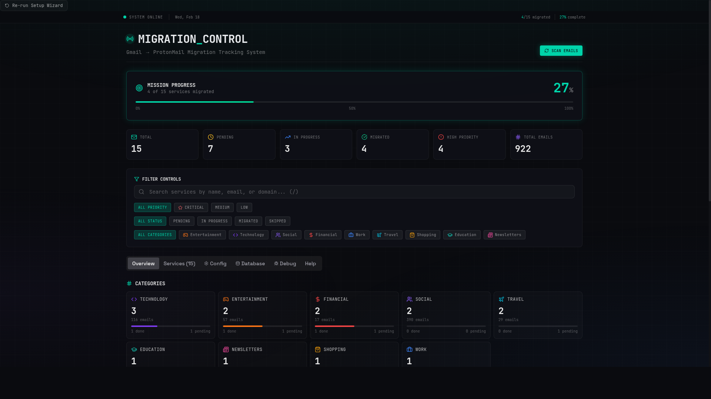

# Proton Email Migration Tracker

Track your migration from an old inbox (ex: Gmail) to Proton by detecting which services still send to the old address and which have moved.

## Goals

- Show migration progress in one place
- Identify high-priority services to migrate first
- Reduce manual inbox hunting
- Keep setup simple for self-hosted users

## Features

- **Dashboard** with migration progress, service stats, and categories
- **Service management** with filters, search, and status updates
- **Onboarding wizard** (identity + IMAP connectivity)
- **IMAP connection test** from the UI
- **Optional demo seed** (mock data) during onboarding
- **Database tools** (health, backup/restore, optimize, seed)
- **Config editor** in UI (writes `config.local.yml`)
- **Automatic scheduler** for periodic scans
- **Docker multi-arch images** published to GHCR

## Quick Start (recommended)

```bash
git clone https://github.com/Sabrimjd/Proton-Email-Migration-Tracker.git
cd Proton-Email-Migration-Tracker
cp docker-compose.example.yml docker-compose.yml
cp .env.docker.example .env

docker compose up -d
```

Open: <http://localhost:3200>

On first launch, complete the onboarding wizard.

## Deployment Options

### 1) Docker Compose (recommended)

Use the provided example files:

- `docker-compose.example.yml`
- `.env.docker.example`

Best for most users.

### 2) Prebuilt GHCR image

```bash
docker pull ghcr.io/sabrimjd/proton-email-migration-tracker:latest
```

Use this image in your own compose/stack setup.

### 3) Local development (npm)

```bash
npm install
npm run dev
```

Open: <http://localhost:3000>

## Releases and Image Tags

Main tags available from GHCR:

- `latest` (main branch)
- `main`
- `<commit-sha>`
- `vX.Y.Z` (when release tags are pushed)

## Screenshots

### Overview



More screenshots:
- `docs/screenshots/README.md`

## Documentation

For deployment details and environment options, see:

- `docs/DEPLOYMENT.md`

## Troubleshooting (quick)

- **IMAP test fails**: ensure Proton Bridge is running and use Bridge credentials (not account password)
- **No services yet**: run a scan from UI, or enable demo seed during onboarding
- **Port conflict**: change port in `.env` / compose file

## License

MIT
